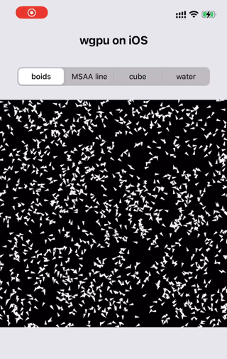

# wgpu on App
Integrate wgpu on your existing iOS | Android apps. 

`winit`-free mode can useful for integrating wgpu into existing apps to implement some graphics features. 

## Screenshot
|||
|---|---|


## **iOS**
### Add build target

Since iPhone 5 and later are 64-bit devices, add `aarch64-apple-ios` and `aarch64-apple-ios-sim` is enough.

```sh
# Add for iPhone 
rustup target add aarch64-apple-ios 
# Add for iOS simulator
rustup target add aarch64-apple-ios-sim
```

### build
```sh
cargo build --target aarch64-apple-ios && cargo build --target aarch64-apple-ios-sim
```

Then, use Xcode to open ```iOS/wgpu_on_iOS.xcodeproj``` and run.

### About Rust and Swift Interaction
[Passing Primitive Data Between Rust and iOS](https://bignerdranch.com/blog/building-an-ios-app-in-rust-part-2-passing-primitive-data-between-rust-and-ios/)

[Passing Owned Objects between Rust and iOS](https://bignerdranch.com/blog/building-an-ios-app-in-rust-part-3-passing-owned-objects-between-rust-and-ios/)

[Sending a boxed trait over FFI](https://users.rust-lang.org/t/sending-a-boxed-trait-over-ffi/21708)

## **Android**
### Set up Android environment

Assuming your computer already has Android Studio installed, go to `Android Studio` > `Tools` > `SDK Manager` > `Android SDK` > `SDK Tools`. Check the following options for installation and click OK. 

- [x] Android SDK Build-Tools
- [x] Android SDK Command-line Tools
- [x] NDK(Side by side)

Then, set two following environment variables:

```sh
export ANDROID_SDK_ROOT=$HOME/Library/Android/sdk
# Replace the NDK version number with the version you installed 
export NDK_HOME=$ANDROID_SDK_ROOT/ndk/23.1.7779620
```


### Add build targets

Since simulator and virtual devices only support GLES, `x86_64-linux-android` and `i686-linux-android` targets are not necessary
```sh
rustup target add aarch64-linux-android armv7-linux-androideabi
```
### Install cargo so subcommand
```sh
# from crates.io
cargo install cargo-so
# frome source code
cargo install --path cargo-so
```

### Build
```sh
# currently, multi-target build only useable on the nightly channel
cargo so b --target aarch64-linux-android --release
cargo so b --target armv7-linux-androideabi --release

# copy .so files to android project jniLibs folder
cp target/aarch64-linux-android/release/libwgpu_on_app.so android/app/libs/arm64-v8a/libwgpu_on_app.so
cp target/armv7-linux-androideabi/release/libwgpu_on_app.so android/app/libs/armeabi-v7a/libwgpu_on_app.so
```

