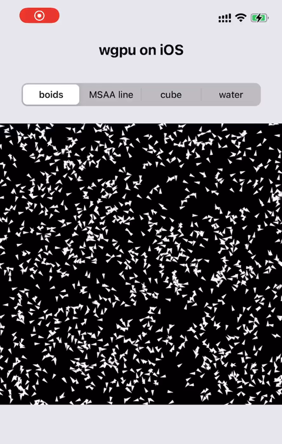

# wgpu in App
Integrate wgpu into your existing iOS | Android apps. 

wgpu does not depend on any window program, so it does not provide window creation and management functions. Only when creating a window-based `Surface`, an argument that implements the [raw-window-handle](https://github.com/rust-windowing/raw-window-handle) abstract interface may be needed (*may be needed* because on iOS/macOS, instance of `Surface` can be created directly by `CAMetalLayer`). The `winit` used by the wgpu examples is a cross-platform window creation and management crate that implements the raw-window-handle abstract interface. It will take over the window management and events loop of the entire app, there is no doubt that for game apps, the combination of wgpu + winit is very suitable.

However, a large number of non-game apps also need to use graphics APIs (such as charts, image filters, etc.). These apps may require a large number of system components, as well as the ability to freely control various input devices (e.g., stylus, motion sensors). So, it would be very useful to integrate wgpu into these apps without using third-party window management libraries.

#### [中文版文档](https://jinleili.github.io/learn-wgpu-zh/integration-and-debugging/)

## Screenshot
|||
|---|---|

## **iOS**

```sh
# Add iOS device target
# Since iPhone 5 and later are 64-bit devices, `armv7s-apple-ios` and `armv7-apple-ios` are not required.
rustup target add aarch64-apple-ios 

# Build for iOS device
sh ./ios_lib_build.sh --release
```

Then, Open `iOS/wgpu_in_iOS_App.xcodeproj` with Xcode an run on iOS device and/or M1+ Mac (Designed for iPad). 

### About Rust and Swift Interaction
[Passing Primitive Data Between Rust and iOS](https://bignerdranch.com/blog/building-an-ios-app-in-rust-part-2-passing-primitive-data-between-rust-and-ios/)

[Passing Owned Objects between Rust and iOS](https://bignerdranch.com/blog/building-an-ios-app-in-rust-part-3-passing-owned-objects-between-rust-and-ios/)

[Sending a boxed trait over FFI](https://users.rust-lang.org/t/sending-a-boxed-trait-over-ffi/21708)

## **Android**

### Set up Android environment

Assuming your computer already has Android Studio installed, go to `Android Studio` > `Tools` > `SDK Manager` > `Android SDK` > `SDK Tools`. Check the following options for installation and click OK. 

- [x] Android SDK Build-Tools
- [x] Android SDK Command-line Tools
- [x] NDK(Side by side)

Then, set two following environment variables:

```sh
export ANDROID_SDK_ROOT=$HOME/Library/Android/sdk
# Replace the NDK version number with the version you installed 
export NDK_HOME=$ANDROID_SDK_ROOT/ndk/23.1.7779620
```

### Install cargo so subcommand
```sh
# from crates.io
cargo install cargo-so
# frome source code
cargo install --path cargo-so
```

### Build
```sh
# Add build targets
# Since simulator and virtual devices only support GLES, `x86_64-linux-android` and `i686-linux-android` targets are not necessary
rustup target add aarch64-linux-android armv7-linux-androideabi

# Build
sh ./android_lib_build.sh --release
```

## **Desktop**
```sh
# Use primary backend (metal vulkan or dx12, depend on your computer OS).
cargo run
# Use OpenGL backend (platforms other than Linux, need to add the `angle` feature).
# https://github.com/gfx-rs/wgpu/pull/2461
WGPU_BACKEND=gl cargo run --features=angle
# Use Vulkan backend (on macOS, need to add the `vulkan-portability` feature)
# https://github.com/gfx-rs/wgpu/pull/2488
WGPU_BACKEND=vk cargo run --features=vulkan-portability
# Then, press 0, 1, 2, 3, 4 keys change running example.
```